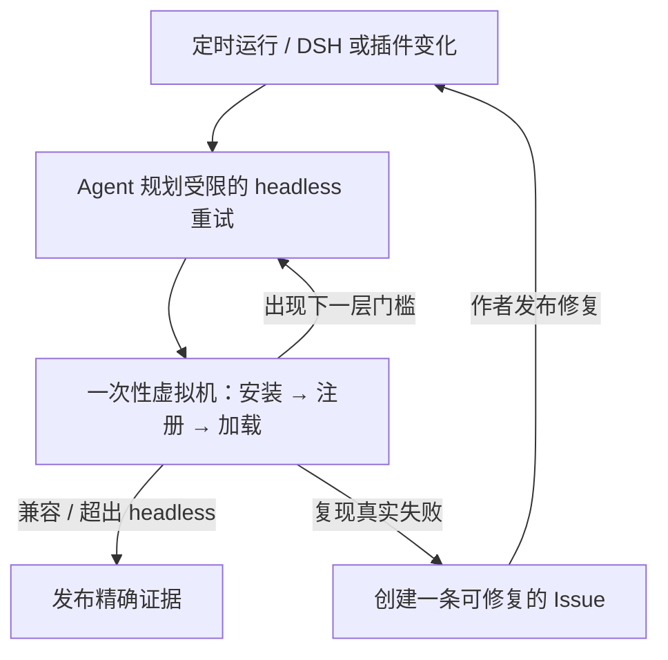

<h1 align="center">Upstream Radar</h1>

<p align="center"><strong>每次 DeepSeek Harness 发布后，在用户踩坑前找出哪些插件坏了。</strong></p>

<p align="center">
  <a href="README.md">English</a> · 简体中文
</p>

<p align="center">
  <a href="https://github.com/MicroMilo/upstream-radar/actions/workflows/ci.yml"></a>
  <a href="https://www.npmjs.com/package/upstream-radar"></a>
  <a href="https://github.com/MicroMilo/upstream-radar/stargazers"></a>
  <a href="LICENSE"></a>
</p>

Upstream Radar 持续把一批真实插件发布物放到一次性隔离环境中，与不断变化的
[DeepSeek Harness（DSH）](https://github.com/deepseek-ai/deepseek-harness)
版本重新配对测试。某个组合坏了，就生成一条可复现的 Issue；作者发布修复后，
Radar 会再次检查并关闭闭环。

**维护 100 个安装/加载目标 · 已提出 13 条 domain 报告 · 4 条已关闭 · 9 条开放或持续观察**

[最近一次 Agent 驱动的 headless 运行](https://github.com/MicroMilo/upstream-radar/actions/runs/32684879130)：
**观测 96 个可执行目录插件 · 74 个兼容 · 22 个需要复核 · 0 个复现不兼容 · 4 个仅源码目标**。
需要复核的信号不会被宣传成插件故障。

第一轮真实闭环从 29 个待复核插件开始。Agent 选择了 9 个受限重试，其中 7 个转为
兼容；另 2 个明确停在 Web 客户端依赖边界，没有被误报成插件坏了。

一句话：`DSH/插件变化 → Agent → 一次性 headless 虚拟机 → 精确证据 → 复测或可修复 Issue`。

## 为什么需要它

仓库看起来正常，不代表用户实际安装的插件仍然可用。真实发布物必须同时适配某个
DSH 版本、Node 运行时、profile 和依赖组合；其中任何一项更新，都可能让插件一夜
之间失效。

Upstream Radar 检查的是这层真实关系，而不只是分别看两个仓库。本地发布前检查
回答“这个插件今天能不能过”；Radar 回答“生态变化后，维护中的哪些插件不再能过”。

## 完整闭环



Agent 读取仓库说明和最新运行证据，决定 headless 是否重试、重试时允许哪些安装条件。
真正的结果由一次性虚拟机执行得出，而不是模型判断。模型不能凭空增加安装包、不能
进入目标虚拟机执行，也不能把缺失证据说成通过。

## 你会得到什么

- `插件版本 × DSH 版本 × Node/profile` 的精确结果，而不是永不过期的“兼容”标签。
- 把 Agent 规划的后续动作，与真实发布物的安装、注册、加载结果放在一起判断。
- DSH 或插件变化后自动重新检查，而不是只生成一次报告。
- 同一问题持续更新；回归时重新打开；干净复测通过后自动关闭。

## 我们闭环中提出的 domain 报告

以下是 Upstream Radar 提出的 13 条面向维护者的报告。它们不全都表示
“插件坏了”：第一组是运行时兼容性，第二组是精确发布物/安装边界，第三组是
持续监控所依赖的依赖图是否可信。

### DSH 宿主/插件契约 · 2 条

- **已关闭** · [Sanqi-normal/dsh-webui-market-plugin#5](https://github.com/Sanqi-normal/dsh-webui-market-plugin/issues/5)
- **开放** · [shaoshi20/dshscan#1](https://github.com/shaoshi20/dshscan/issues/1)

### 发布物与安装契约 · 7 条

- **已关闭** · [1na-ko/dsh-hdc-bridge#3](https://github.com/1na-ko/dsh-hdc-bridge/issues/3)
- **已关闭** · [6Mikao9/dsh-wsl-workspace#6](https://github.com/6Mikao9/dsh-wsl-workspace/issues/6)
- **已关闭** · [3274375092/dsh-voice#2](https://github.com/3274375092/dsh-voice/issues/2)
- **开放** · [AmeKrance/anan-thermal-monitor#1](https://github.com/AmeKrance/anan-thermal-monitor/issues/1)
- **开放** · [AbcdefgXW/dsh-msg-hub#3](https://github.com/AbcdefgXW/dsh-msg-hub/issues/3)
- **开放** · [030611/dsh-verification-receipt#3](https://github.com/030611/dsh-verification-receipt/issues/3)
- **开放** · [0xsline/dsh-spotlight#5](https://github.com/0xsline/dsh-spotlight/issues/5)

### 依赖图与源码/发布版本对齐 · 4 条

- **开放** · [lninghaha/dsh-coding-subscription-oauth#14](https://github.com/lninghaha/dsh-coding-subscription-oauth/issues/14)
- **开放** · [AbcdefgXW/dsh-msg-hub#1](https://github.com/AbcdefgXW/dsh-msg-hub/issues/1)
- **开放** · [AbcdefgXW/dsh-toolbox-web#1](https://github.com/AbcdefgXW/dsh-toolbox-web/issues/1)
- **开放** · [13071301808/dsh-composer-expand#1](https://github.com/13071301808/dsh-composer-expand/issues/1)

你记得的 browser/web 案例——[`dsh-web-ui#35`](https://github.com/zhu1090093659/dsh-web-ui/issues/35)
和 [`dsh-web-ui#71`](https://github.com/zhu1090093659/dsh-web-ui/issues/71)——是有价值的历史兼容性
对照，且目前已关闭；但它们不是 Upstream Radar 提出的报告，所以不计入上面的 13 条。
当前维护中的 `dsh-browser` 条目也都观测为兼容，不应被列成问题。

查看[完整分类与证据索引](docs/domain-reports.md)，其中区分了动态复现、源码/发布物证据，
以及仍需维护者确认的弱结论。

## 检查一个插件

```bash
npx --yes upstream-radar@0.43.4 review dsh-plugin \
  <包名>@<版本> \
  --dsh-version <DSH版本>
```

需要执行插件代码时，请使用仓库维护的
[隔离观察工作流](.github/workflows/observe-dsh-plugin-install.yml)：每个组合都会获得
一台全新的、无密钥的 GitHub 托管虚拟机和受限容器。

你还可以查看[实时兼容性矩阵](examples/dsh/install-observer/README.md)、
[可供目录消费的兼容性结果](feeds/dsh-plugin-compatibility.md)、
[第一批 50 个插件](examples/dsh/first-batch/README.md)和
[架构说明](docs/architecture.md)。

<p align="center">
  <strong>如果 Upstream Radar 对 DSH 生态有帮助，欢迎<a href="https://github.com/MicroMilo/upstream-radar">点一个 Star</a> ⭐</strong>
</p>
