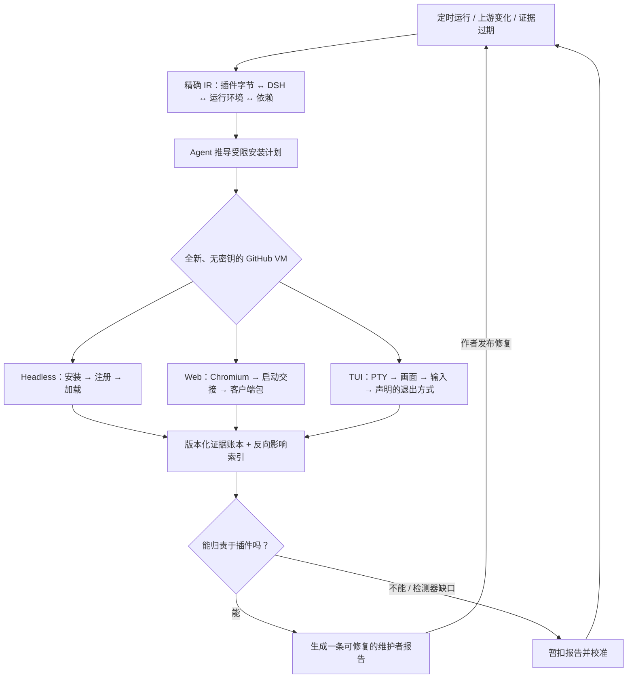

<h1 align="center">Upstream Radar</h1>

<p align="center"><strong>持续验证 DeepSeek Harness 插件兼容性——覆盖 headless、Web 和 TUI。</strong></p>

<p align="center">
  <a href="README.md">English</a> ·
  <a href="https://github.com/MicroMilo/upstream-radar/actions/workflows/ci.yml"></a>
  <a href="https://www.npmjs.com/package/upstream-radar"></a>
  <a href="https://github.com/MicroMilo/upstream-radar/stargazers"></a>
  <a href="LICENSE"></a>
</p>

Upstream Radar 把精确的插件发布物、DSH 宿主和运行环境绑定在一起，让 Agent 根据仓库说明和
已有失败证据推导受限环境，再放进一次性 GitHub VM 中实际验证。生态发生变化或证据过期后都会
重跑，因此它检查的是**当前版本是否仍然可用**，而不只是比较一次 diff。

它面向 [DeepSeek Harness（DSH）](https://github.com/deepseek-ai/deepseek-harness) 插件生态。
静态检查是关于发布包的证据；隔离运行检查是关于某个精确的
`插件 × DSH × Node/profile` 组合的证据。两者都不会被包装成永久有效的“兼容”徽章或安全证书。

> 已被 DSH 生态目录
> [awesome-dsh-plugin](https://github.com/awesome-dsh-plugin/awesome-dsh-plugin/blob/main/data/plugins/MicroMilo__upstream-radar.yml)、
> [awesome-deepseek-harness](https://github.com/0xsline/awesome-deepseek-harness) 和
> [awesome-deepseek-harness-plugins](https://github.com/imsai-sh/awesome-deepseek-harness-plugins/blob/main/catalog/plugins/micromilo--upstream-radar.json)
> 收录。

## 为什么需要它

插件源码仓库看起来正常，但用户真正安装的发布物可能还没有适配当前 DSH 宿主：

- README 宣传的版本根本没有发布；
- 插件实际导入了比 peer range 更新的 DSH 包；
- `package.json` 和 lockfile 描述的不是同一个版本；
- 安装阶段需要构建工具或依赖脚本，而用户环境没有；
- DSH 宿主依赖没有发布，完整依赖图无法建立。

这些是生态关系问题。分别检查两个仓库，很容易漏掉它们。

## Radar 做什么

1. **建立统一兼容记录（IR）。** 对齐 npm 发布物、源码 commit、DSH 宿主、运行环境/profile、依赖路径和漏洞情报。
2. **推导运行环境。** Agent 读取作者声明的安装说明和失败证据，只输出边界明确的安装计划。
3. **验证不同执行平面。** 全新、无密钥的 runner 分别验证 headless 加载、Chromium Web 启动或真实 PTY TUI 交互。
4. **让结果持续有效。** DSH/插件/依赖变化以及证据过期都会触发复测；确认的问题变成可修报告，干净复测后完成闭环。



Agent 可以选择作者声明的构建包、profile 设置和下一次受限重试。精确指纹决定一份报告能填入
哪个测试格子；真正的结果由一次性虚拟机执行得出，而不是模型判断。缺失证据永远不能变成通过。

## 试试一个真实检查

第一次检查不需要本地 DSH profile，也不会执行插件代码：

```bash
npx --yes upstream-radar@0.45.0 inspect \
  @sanqi-normal/dsh-webui-market-plugin@0.5.4 \
  --deep --fail-on never
```

这个历史 DSH 插件版本会返回 `review / incomplete`，因为它发布的宿主依赖链指向了一个不可用的包。
这是可复现的发布/宿主契约问题，不是恶意行为指控。查看[完整证据报告](examples/dsh/reports/sanqi-market-plugin-dependency-resolution.md)。

如果要检查自己的公开仓库，而不安装它：

```bash
npx --yes upstream-radar@0.45.0 scan \
  https://github.com/owner/dsh-plugin \
  --fail-on never
```

仓库扫描会读取源码 manifest、DSH 元数据和 lockfile；不会安装依赖、执行 lifecycle script、加载插件、启动 DSH 或调用 LLM。

## 让它持续运行

把下面任意一个维护好的 workflow 复制到你的仓库：

- [跨多个 DSH 版本检查一个精确插件](examples/github-actions/dsh-plugin-review-minimal.yml)：手动触发，得到发布物证据和隔离加载矩阵。
- [每天观察一个插件仓库](examples/github-actions/upstream-observer-minimal.yml)：比较 commit、发布版本、manifest 和依赖图，只有发生重要变化才唤起 Agent。
- [在 CI 中运行依赖门禁](examples/github-actions/upstream-radar.yml)：在合并前检查 lockfile 或审查过的 Radar 配置。

隔离的 [headless](.github/workflows/observe-dsh-plugin-install.yml) 和
[Web/TUI](.github/workflows/observe-dsh-plugin-surface.yml) workflow 都使用全新的 GitHub 托管 runner。
它们不是你的电脑，也不会接收项目或模型密钥。

## 来自真实生态的结果

当前的[100 插件兼容性 feed](feeds/dsh-plugin-compatibility.md)记录了 **87 个已观测兼容、
9 个待复核、0 个已复现不兼容和 4 个尚未观测**。执行平面账本包含 22 个精确 Web/TUI
格子；目前 22 个都已在隔离 GitHub VM 中通过。

剩余 9 个待复核格子不是被藏起来的失败：其中 7 个已有绿色 Web 证明，但仍保留独立的
headless 宿主/peer 契约证据；另 2 个仍声明旧 DSH 宿主包范围，并已有维护者 Issue 跟踪。
Radar 会保留这些事实，但不会把能正常运行的浏览器插件说成坏了。

首批非 headless 测试已经在 GitHub 托管 VM 中跑通：

| 精确测试格子 | 实际证据 | 结果 |
| --- | --- | --- |
| [`dsh-univer-office@0.2.9 × DSH 0.1.1-rc.2 × Web`](https://github.com/MicroMilo/upstream-radar/actions/runs/32823035297/job/97726205358) | HTTP 200、DSH 启动完成交接、客户端下载成功、浏览器和页面无错误 | **兼容** |
| [`@deepseek-harness-tui/dsh-tui@0.9.2 × DSH 0.1.1-rc.2 × TUI`](https://github.com/MicroMilo/upstream-radar/actions/runs/32823035297/job/97726205289) | 真实 PTY 画面、键盘输入、按文档双击 Ctrl-C 后以 code 0 退出 | **兼容** |
| [`@linxin666/dsh-web-all@0.3.3 × DSH 0.1.1-rc.2 × Web`](https://github.com/MicroMilo/upstream-radar/actions/runs/32828788296/job/97742850608) | Agent 批准 4 个依赖构建；聚合客户端包返回 200；启动清单、应用挂载和插件实体相互吻合 | **兼容** |
| [`dsh-better-sidebar@0.16.1 × DSH 0.1.1-rc.2 × Web`](https://github.com/MicroMilo/upstream-radar/actions/runs/32835449819/job/97763410354) | VM 发现 `node-pty` 构建门槛；DeepSeek 只批准这个精确依赖；无密钥重试通过安装、宿主、浏览器交互和关闭阶段 | **兼容** |

`better-sidebar` 展示了完整闭环：动态证据发现 headless 计划没遇到的构建要求；DeepSeek 核对
精确 manifest、README 和 VM 日志；与指纹绑定的策略只批准 `node-pty`；随后另一台不带模型密钥
的 runner 给出通过结论。这是 Radar 的环境缺口，因此没有向插件作者提交 Issue。此前 TUI 与 Web
检测器自身的错误也按同样方式处理：先暂扣、修正并复测，而不是发给作者。

截至 2026-08-25，Radar 共向维护者提交了 13 条报告。比数量更重要的是处理结果：

| 结果 | 报告 |
| --- | --- |
| **已发布修复并复核（5）** | [Sanqi #5](https://github.com/Sanqi-normal/dsh-webui-market-plugin/issues/5)（`0.5.5`）、[HDC #3](https://github.com/1na-ko/dsh-hdc-bridge/issues/3)（`0.7.3`）、[Voice #2](https://github.com/3274375092/dsh-voice/issues/2)（`0.2.6`）、[Msg Hub #1](https://github.com/AbcdefgXW/dsh-msg-hub/issues/1)、[Toolbox Web #1](https://github.com/AbcdefgXW/dsh-toolbox-web/issues/1) |
| **维护者复核或补充契约（3）** | [Msg Hub #3](https://github.com/AbcdefgXW/dsh-msg-hub/issues/3)、[Spotlight #5 / PR #7](https://github.com/0xsline/dsh-spotlight/pull/7)、[WSL Workspace #6](https://github.com/6Mikao9/dsh-wsl-workspace/issues/6)——均已关闭，但不冒充运行时修复 |
| **仍开放（5）** | [Anan #1](https://github.com/AmeKrance/anan-thermal-monitor/issues/1)、[Verification Receipt #3](https://github.com/030611/dsh-verification-receipt/issues/3)、[dshscan #1](https://github.com/shaoshi20/dshscan/issues/1)、[OAuth #14](https://github.com/lninghaha/dsh-coding-subscription-oauth/issues/14)、[Composer Expand #1](https://github.com/13071301808/dsh-composer-expand/issues/1) |

“关闭”不自动等于“修复”。[完整的 domain 报告索引](docs/domain-reports.md)逐条保留了证据、
验证等级、PR 覆盖和剩余边界。

<p align="center">
  <strong>如果 Upstream Radar 对 DSH 生态有帮助，欢迎<a href="https://github.com/MicroMilo/upstream-radar">点一个 Star</a> ⭐</strong>
</p>
