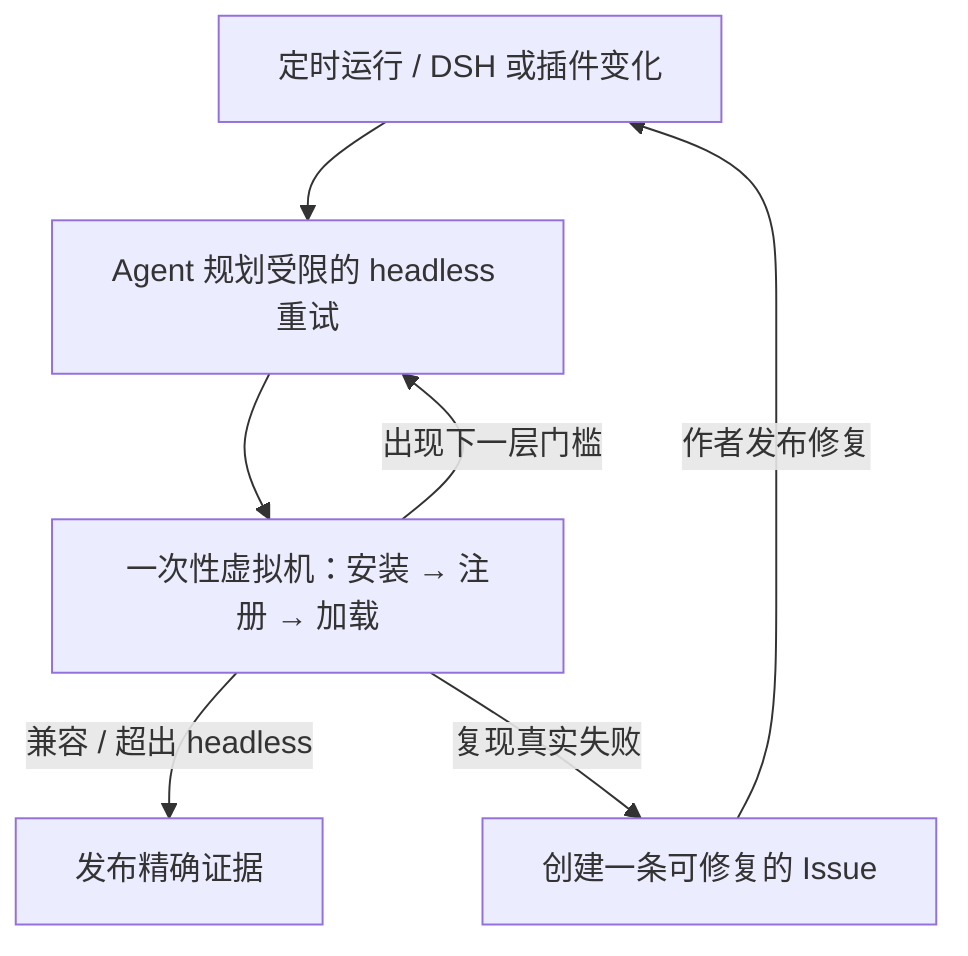

<h1 align="center">Upstream Radar</h1>

<p align="center"><strong>在 DeepSeek Harness 生态变化后，找出哪些插件需要维护者关注。</strong></p>

<p align="center">
  <a href="README.md">English</a> ·
  <a href="https://github.com/MicroMilo/upstream-radar/actions/workflows/ci.yml"></a>
  <a href="https://www.npmjs.com/package/upstream-radar"></a>
  <a href="https://github.com/MicroMilo/upstream-radar/stargazers"></a>
  <a href="LICENSE"></a>
</p>

Upstream Radar 持续检查三者之间的真实关系：精确的 DSH 插件发布物、DSH 宿主和依赖图。
当 DSH 或插件发布新版本改变这层关系时，Radar 告诉你变了什么、实际观测到了什么，以及维护者
可以修什么。

它面向 [DeepSeek Harness（DSH）](https://github.com/deepseek-ai/deepseek-harness) 插件生态。
静态检查是关于发布包的证据；隔离运行检查是关于某个精确的
`插件 × DSH × Node/profile` 组合的证据。两者都不会被包装成永久有效的“兼容”徽章或安全证书。

> 已被 DSH 生态目录
> [awesome-dsh-plugin](https://github.com/awesome-dsh-plugin/awesome-dsh-plugin/blob/main/data/plugins/MicroMilo__upstream-radar.yml)、
> [awesome-deepseek-harness](https://github.com/0xsline/awesome-deepseek-harness) 和
> [awesome-deepseek-harness-plugins](https://github.com/imsai-sh/awesome-deepseek-harness-plugins/blob/main/catalog/plugins/micromilo--upstream-radar.json)
> 收录。

## 为什么需要它

插件源码仓库看起来正常，但用户真正安装的发布物可能还没有适配当前 DSH 宿主：

- README 宣传的版本根本没有发布；
- 插件实际导入了比 peer range 更新的 DSH 包；
- `package.json` 和 lockfile 描述的不是同一个版本；
- 安装阶段需要构建工具或依赖脚本，而用户环境没有；
- DSH 宿主依赖没有发布，完整依赖图无法建立。

这些是生态关系问题。分别检查两个仓库，很容易漏掉它们。

## Radar 做什么

1. **锁定真实输入。** 读取精确 npm 发布物、DSH 版本、Node 运行时、profile、lockfile 和依赖路径。
2. **比较真实关系。** 发现上游变化、发布/源码漂移、依赖图不完整和 DSH 契约不一致。
3. **需要执行时再观察。** 在全新的、无密钥的环境中安装、注册并加载精确发布物，记录结果和边界。
4. **完成闭环。** 生成有边界的证据，把重要变化交给可选的 DSH Agent，并在干净复测后更新或关闭一条面向维护者的 Issue。



Agent 读取仓库说明和最新运行证据，决定 headless 是否重试、重试时允许哪些安装条件。
真正的结果由一次性虚拟机执行得出，而不是模型判断。模型不能凭空增加安装包、不能进入目标
虚拟机执行，也不能把缺失证据说成通过。

## 试试一个真实检查

第一次检查不需要本地 DSH profile，也不会执行插件代码：

```bash
npx --yes upstream-radar@0.43.4 inspect \
  @sanqi-normal/dsh-webui-market-plugin@0.5.4 \
  --deep --fail-on never
```

这个历史 DSH 插件版本会返回 `review / incomplete`，因为它发布的宿主依赖链指向了一个不可用的包。
这是可复现的发布/宿主契约问题，不是恶意行为指控。查看[完整证据报告](examples/dsh/reports/sanqi-market-plugin-dependency-resolution.md)。

如果要检查自己的公开仓库，而不安装它：

```bash
npx --yes upstream-radar@0.43.4 scan \
  https://github.com/owner/dsh-plugin \
  --fail-on never
```

仓库扫描会读取源码 manifest、DSH 元数据和 lockfile；不会安装依赖、执行 lifecycle script、加载插件、启动 DSH 或调用 LLM。

## 让它持续运行

把下面任意一个维护好的 workflow 复制到你的仓库：

- [跨多个 DSH 版本检查一个精确插件](examples/github-actions/dsh-plugin-review-minimal.yml)：手动触发，得到发布物证据和隔离加载矩阵。
- [每天观察一个插件仓库](examples/github-actions/upstream-observer-minimal.yml)：比较 commit、发布版本、manifest 和依赖图，只有发生重要变化才唤起 Agent。
- [在 CI 中运行依赖门禁](examples/github-actions/upstream-radar.yml)：在合并前检查 lockfile 或审查过的 Radar 配置。

[隔离观察 workflow](.github/workflows/observe-dsh-plugin-install.yml) 会为需要执行代码的检查使用全新的 GitHub 托管 runner。
它不是你的电脑，也不会接收项目密钥。

## 来自真实生态的结果

截至 2026-08-25，Radar 共向维护者提交了 13 条报告。比数量更重要的是处理结果：

| 结果 | 报告 |
| --- | --- |
| **已发布修复并复核（5）** | [Sanqi #5](https://github.com/Sanqi-normal/dsh-webui-market-plugin/issues/5)（`0.5.5`）、[HDC #3](https://github.com/1na-ko/dsh-hdc-bridge/issues/3)（`0.7.3`）、[Voice #2](https://github.com/3274375092/dsh-voice/issues/2)（`0.2.6`）、[Msg Hub #1](https://github.com/AbcdefgXW/dsh-msg-hub/issues/1)、[Toolbox Web #1](https://github.com/AbcdefgXW/dsh-toolbox-web/issues/1) |
| **维护者复核或补充契约（3）** | [Msg Hub #3](https://github.com/AbcdefgXW/dsh-msg-hub/issues/3)、[Spotlight #5 / PR #7](https://github.com/0xsline/dsh-spotlight/pull/7)、[WSL Workspace #6](https://github.com/6Mikao9/dsh-wsl-workspace/issues/6)——均已关闭，但不冒充运行时修复 |
| **仍开放（5）** | [Anan #1](https://github.com/AmeKrance/anan-thermal-monitor/issues/1)、[Verification Receipt #3](https://github.com/030611/dsh-verification-receipt/issues/3)、[dshscan #1](https://github.com/shaoshi20/dshscan/issues/1)、[OAuth #14](https://github.com/lninghaha/dsh-coding-subscription-oauth/issues/14)、[Composer Expand #1](https://github.com/13071301808/dsh-composer-expand/issues/1) |

“关闭”不自动等于“修复”。[完整的 domain 报告索引](docs/domain-reports.md)逐条保留了证据、
验证等级、PR 覆盖和剩余边界。

<p align="center">
  <strong>如果 Upstream Radar 对 DSH 生态有帮助，欢迎<a href="https://github.com/MicroMilo/upstream-radar">点一个 Star</a> ⭐</strong>
</p>
