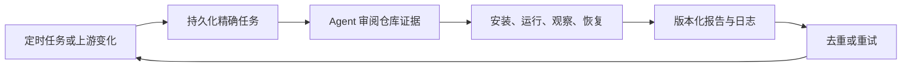

<h1 align="center">Upstream Radar</h1>

<p align="center"><strong>在用户踩坑之前，先知道哪些 DeepSeek Harness 插件还能正常工作。</strong></p>

<p align="center">
  <a href="README.md">English</a> ·
  <a href="https://github.com/MicroMilo/upstream-radar/actions/workflows/ci.yml"></a>
  <a href="https://www.npmjs.com/package/upstream-radar"></a>
  <a href="https://github.com/MicroMilo/upstream-radar/stargazers"></a>
  <a href="LICENSE"></a>
</p>

Upstream Radar 持续监听精确的 DSH 与插件版本。输入变化后，它先持久化受影响任务，再唤醒
Agent。Agent 会阅读仓库材料，推理有证据支持的 Node.js、包管理器和运行 profile，在一次性
CI 环境里安装并运行精确发布物，运行期间持续观察和恢复，最后生成可复核的兼容性报告。

**不盲猜测试矩阵，不把“安装成功”冒充兼容，也不把未知悄悄写成通过。**

## 你会得到什么

- **变化驱动的分析**：DSH 更新时展开到配置的插件批次；插件更新时只分析对应插件。
- **由 Agent 负责环境取证**：README、manifest、锁文件、CI 和启动脚本共同决定 Node.js、
  包管理器与 profile。
- **主动运行监测**：Agent 读取增量日志、检查运行进程、处理可恢复构建门槛并按证据重试。
- **精确且持久的证据**：报告绑定插件字节、源码 commit、DSH、Node.js、profile、命令与日志。
- **可重试、会去重**：执行器中断后任务保持待处理；相同的已完成输入不会重复运行。

## 完整闭环


```mermaid
flowchart LR
  Change["定时任务或上游变化"] --> Task["持久化精确任务"]
  Task --> Agent["Agent 审阅仓库证据"]
  Agent --> Run["安装、运行、观察、恢复"]
  Run --> Report["版本化报告与日志"]
  Report --> State["去重或重试"]
  State --> Change
```

模型只在有边界的工具协议内推荐和操作。确定性代码负责选择精确版本、校验发布物、隔离执行，
并判断证据是否完整。插件代码拿不到模型密钥或仓库写入凭证。

## 查看真实运行

- [实时兼容性报告索引](examples/dsh/active-agent/reports/README.md)：任务完成表示分析已经闭环，
  **不代表插件一定兼容**。
- [一次真实的 `context` Agent 运行](https://github.com/MicroMilo/upstream-radar/actions/runs/36435594284/job/108979891718)：
  在同一个任务里完成仓库审阅、Node/profile 推理、隔离执行和主动观察。
- [一次全绿的持久任务重试](https://github.com/MicroMilo/upstream-radar/actions/runs/36439763569)：
  相同输入得到空矩阵，没有制造重复分析。

报告会分别保留 `compatible`、`incompatible`、`unknown` 和外部受阻结果。缺少账号、覆盖不足
或执行器故障都不能变成通过。

## 30 秒试用

检查一个精确 npm 发布物，不执行插件代码：

```bash
npx --yes upstream-radar@0.45.0 inspect \
  @sanqi-normal/dsh-webui-market-plugin@0.5.4 \
  --deep --fail-on never
```

或者审阅一个公开插件仓库，不安装它：

```bash
npx --yes upstream-radar@0.45.0 scan \
  https://github.com/owner/dsh-plugin \
  --fail-on never
```

这些静态命令只读取有边界的包与仓库证据，不会安装依赖、执行 lifecycle script、启动 DSH
或调用 LLM。

## 接入自动兼容性闭环

从一个维护中的 workflow 开始：

- [每天监听一个插件仓库](examples/github-actions/upstream-observer-minimal.yml)
- [跨 DSH 版本审阅一个精确插件](examples/github-actions/dsh-plugin-review-minimal.yml)
- [在 CI 中拦截依赖风险](examples/github-actions/upstream-radar.yml)

本仓库已经部署的入口是
[`upstream-observer.yml`](.github/workflows/upstream-observer.yml)，唯一的操作配置入口是
[`examples/dsh/active-agent/policy.json`](examples/dsh/active-agent/policy.json)：

```json
{
  "schema": "upstream-radar.dsh-active-agent-policy/v1alpha1",
  "dsh": { "channel": "next" },
  "defaults": {},
  "plugins": [
    { "targetId": "context" },
    { "targetId": "dsh-tui" }
  ]
}
```

Node.js 和 profile 留空时由 Agent 推理；需要固定实验时，可以在全局或单个插件上覆盖。精确
DSH 或插件版本必须同时提供匹配的 `sourceRef`，避免仓库证据与实际安装字节漂移。完整字段见
[策略说明](examples/dsh/active-agent/POLICY.md)。

## 如何理解结果

| 结果 | 含义 |
| --- | --- |
| `compatible` | 精确测试格子的安装和所需运行检查均已完成。 |
| `incompatible` | 可复现证据没有通过必要的兼容边界。 |
| `unknown` | 已执行，但覆盖或归因不足，不能下通过结论。 |
| `blocked` | 外部账号、凭证、数据源或执行器阻止了分析完成。 |

这些结果是有范围的观察，不是永久兼容徽章或安全证书。发布物、源码 commit、DSH、运行策略
发生变化，或证据过期后，都会形成新的精确输入。

## 适合谁

- **插件作者**：在用户报告问题之前发现发布兼容故障。
- **DSH 生态维护者**：获得一份口径一致、可以审计的证据源。
- **平台团队**：用可重复的升级依据，替代人工翻 README 和日志。

Upstream Radar 已被
[awesome-dsh-plugin](https://github.com/awesome-dsh-plugin/awesome-dsh-plugin/blob/main/data/plugins/MicroMilo__upstream-radar.yml)、
[awesome-deepseek-harness](https://github.com/0xsline/awesome-deepseek-harness) 和
[awesome-deepseek-harness-plugins](https://github.com/imsai-sh/awesome-deepseek-harness-plugins/blob/main/catalog/plugins/micromilo--upstream-radar.json)
收录。

<p align="center">
  <strong>如果这正是你的插件生态需要的兼容闭环，欢迎<a href="https://github.com/MicroMilo/upstream-radar">给 Upstream Radar 一个 Star</a> ⭐</strong>
</p>
