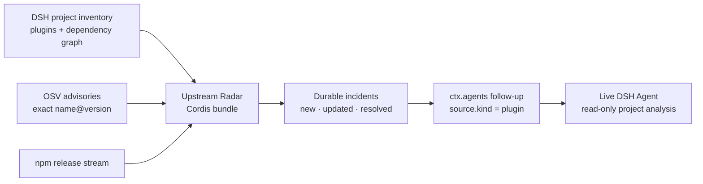

<div align="center">

# Upstream Radar

### The upstream safety loop for DeepSeek Harness

**Wake a DSH Agent only when an upstream vulnerability or breaking release actually reaches its plugin graph.**

[](https://github.com/MicroMilo/upstream-radar/actions/workflows/ci.yml)
[](examples/dsh/README.md)
[](LICENSE)
[](package.json)
[](ROADMAP.md)

A native DSH bundle that watches OSV and npm, preserves the exact dependency path, creates durable incidents, and hands bounded project analysis to a live DeepSeek Harness Agent.

</div>

---

[DeepSeek Harness](https://github.com/deepseek-ai/deepseek-harness) is built around **Everything is a Plugin**. That makes it easy to grow an Agent, but it also means every profile inherits a moving graph of plugins, transitive packages, DSH services, and Cordis boundaries.

An upstream advisory alone does not answer the questions a DSH user actually has:

- Which installed plugin brought this package into my profile?
- Which exact version and dependency path are affected?
- Does the vulnerable feature reach this workspace?
- Will the available fix break Node.js, a DSH peer range, an export, or the bundle patch?
- Can the Agent investigate without treating advisory prose as trusted instructions?

Upstream Radar is the missing loop between DSH's plugin graph and DSH's Agent runtime.



## Try it inside real DSH

```bash
git clone https://github.com/MicroMilo/upstream-radar.git
cd upstream-radar
corepack enable
pnpm install --frozen-lockfile
pnpm run try:dsh
```

This is an executable integration test, not an import check. It installs the packed bundle into a fresh `@deepseek-ai/dsh@0.1.0-rc.6` `headless` profile and boots the real Cordis loader, DSH Agent, Session, DeepSeek adapter, and persistence stack.

The same deterministic DSH run is part of CI on Node.js 22.

Only the paid model endpoint is replaced with a local deterministic DeepSeek-compatible stub, so the trial needs no API key. The run fails unless DSH actually receives the Radar task and preserves its plugin identity:

```json
{
  "bundleInstalled": true,
  "radarTaskReachedModel": true,
  "pluginSourcePreserved": true,
  "pendingTasksAfterDelivery": 0
}
```

See the [DSH showcase contract](examples/dsh/README.md) and its checked-in [result](examples/dsh/reports/headless-smoke.json).

To exercise the native startup poll against current OSV and npm data before the DSH handoff:

```bash
pnpm run try:dsh:live
```

## Why this is a DSH plugin

| DSH seam | Upstream Radar behavior |
| --- | --- |
| Bundle installation | Ships `dsh.bundle` plus `cordis.patch.yml`; [`dsh plugin add`](https://github.com/deepseek-ai/deepseek-harness/blob/master/docs/user/develop/basic/publish.md) appends it to the selected profile |
| Cordis lifecycle | Runs one bounded startup check and a serialized timer loop; teardown waits for in-flight state writes |
| Agent delivery | Uses `ctx.agents.roots()[0].followup(...)`, not a separate bot or remote-control channel |
| Message identity | Marks every handoff as `source.kind = plugin`, `plugin = upstream-radar`, `form = notice` |
| Offline behavior | Persists the incident and analysis task before attempting Agent delivery |
| Agent startup | Retries queued delivery on DSH's `agent/created` event |
| DSH compatibility | Watches `@deepseek-ai/dsh-*`, `@deepseek-ai/cordis`, Node engines, peer ranges, entrypoints, exports, and bundle changes |

No inventory means no polling: the installed bundle stays dormant until `UPSTREAM_RADAR_CONFIG` is set.

## Run it in an always-on DSH profile

Build a project inventory shaped like [examples/radar/config.json](examples/radar/config.json), then install the bundle into the DSH profile that should own the loop:

```bash
pnpm build
pnpm pack --pack-destination /tmp

export UPSTREAM_RADAR_CONFIG=/absolute/path/radar-config.json
export UPSTREAM_RADAR_STATE=/absolute/path/radar-state.json
export UPSTREAM_RADAR_INTERVAL_SECONDS=1800

dsh plugin --profile web add /tmp/upstream-radar-0.4.0.tgz
dsh --profile web --dump-config
dsh --profile web
```

While the profile is running, Upstream Radar:

1. queries OSV for every exact installed npm `name@version`;
2. checks npm releases for each installed plugin and DSH/Cordis package;
3. records only meaningful `new`, `updated`, and `resolved` incident transitions;
4. keeps one current analysis task per incident;
5. delivers it to the first live root DSH Agent;
6. leaves it on disk when no Agent is live.

## Exact dependency paths, not package-name guesses

Given this installed graph:

```text
plugin@1.0.0
├── framework@2.4.7
│   ├── parser@3.2.1
│   └── archive@1.8.0
└── logger@4.0.2
    └── parser@2.9.0
```

an advisory affecting only `parser@2.9.0` produces:

```text
[HIGH][NEW] Dependency vulnerability
Project: Payments API (payments-api)
Plugin: plugin@1.0.0
Affected: parser@2.9.0
Path: plugin@1.0.0 -> logger@4.0.2 -> parser@2.9.0
Fixed versions: 3.0.0
```

The unaffected `parser@3.2.1` node stays distinct. Duplicate versions and every bounded root-to-package path are preserved.

## DSH breaking-change radar

Vulnerability alerts are only half of the problem. DSH is a developer preview and its plugin contracts are moving quickly, so Upstream Radar also detects candidate releases that:

- exclude the project's Node.js version;
- exclude an installed `@deepseek-ai/dsh-*` or `@deepseek-ai/cordis` peer version;
- change `main`, `exports`, or a DSH bundle patch path;
- remove dependencies the installed release declared;
- cross a major or pre-1.0 breaking version boundary;
- explicitly declare a breaking change in supplied release notes.

These are compatibility signals, not claims that the project is already broken. The DSH Agent still has to inspect the workspace and cite project evidence.

## Program facts vs. DSH Agent judgment

Upstream Radar determines facts that must not be guessed by a model:

```text
parser@2.9.0 is reported as affected
plugin -> logger -> parser is the installed path
the project runs Node.js 22
the candidate requires Node.js >=24
the installed DSH peer is outside the candidate range
```

The DSH Agent handles the repository-specific questions:

```text
is the vulnerable feature reachable here?
can attacker-controlled input reach it?
which API or Cordis configuration would the upgrade disturb?
what is the least disruptive project-specific action?
```

Advisory text, release notes, links, package names, and repository strings stay inside an explicitly untrusted `event_json` boundary. The generated follow-up requires read-only analysis, project evidence, preserved uncertainty, and a fixed [result schema](schemas/analysis-result.schema.json). Model reasoning cannot rewrite the deterministic match.

## What works today

- npm lockfile graphs with physical nodes, duplicate versions, and bounded paths;
- exact-version OSV vulnerability and malicious-package matching;
- npm release monitoring for installed plugins and DSH/Cordis packages;
- durable incident state and current-task replacement;
- native DSH bundle installation, startup polling, `agent/created` delivery, and plugin-source attribution;
- manifest-level compatibility signals for Node.js, peers, exports, entrypoints, bundle paths, dependencies, and version boundaries;
- a network-free Radar showcase via `pnpm run showcase:radar`;
- a real DSH runtime showcase via `pnpm run try:dsh`.

The original bounded pre-install scanner remains available as a supporting collector:

```bash
node dist/src/cli.js scan /path/to/dsh-plugin
node dist/src/cli.js inspect npm:dsh-cloudflare-browser-run@0.1.1 --deep
```

## Current boundaries

- Project inventory is currently explicit JSON; automatic discovery from the active DSH profile is not implemented yet.
- npm lock graphs are supported; pnpm and Yarn graph adapters are not implemented.
- OSV and npm `latest` are the live sources; GitHub release and migration-guide ingestion are deferred.
- DSH currently routes to the first live root Agent rather than a project-specific session.
- The Agent's final analysis remains in its DSH Session; Radar does not yet ingest it back into incident state.
- Source/API diffing and disposable compatibility execution are intentionally deferred.
- No Issue, branch, Pull Request, dependency override, or merge is created automatically.

The task-export CLI is retained as a debugging boundary, but native DeepSeek Harness operation is the product focus.

Upstream Radar is alpha software built against the developer-preview DSH ecosystem. Event schemas and adapter boundaries can still change.

## Project guide

- [DSH headless showcase](examples/dsh/README.md)
- [Architecture](docs/architecture.md)
- [Radar showcase walkthrough](docs/showcase.md)
- [Product vision（中文）](docs/vision.zh-CN.md)
- [Checks and evidence（中文）](docs/checks.zh-CN.md)
- [Threat model](docs/threat-model.md)
- [Roadmap](ROADMAP.md)
- [Contributing](CONTRIBUTING.md)
- [Security policy](SECURITY.md)

Apache-2.0 licensed.
