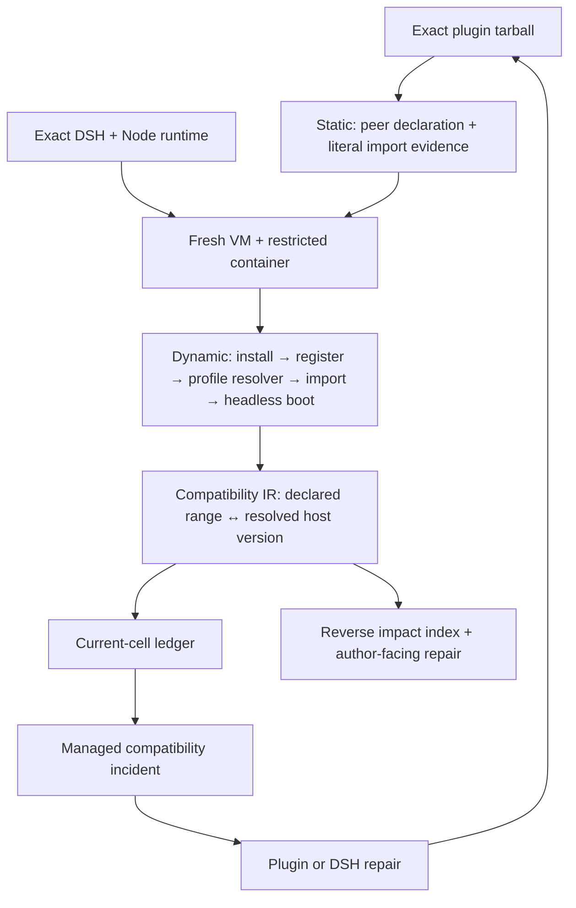

# Upstream Radar

[](https://github.com/MicroMilo/upstream-radar/actions)
[](https://www.npmjs.com/package/upstream-radar)
[](https://github.com/MicroMilo/upstream-radar/stargazers)
[](LICENSE)

**Compatibility evidence for the [DeepSeek Harness (DSH)](https://github.com/deepseek-ai/deepseek-harness) plugin ecosystem.**

A plugin repository can look healthy while its published artifact has drifted
from the DSH host it actually runs in. Upstream Radar joins what a plugin
declares with what an isolated DSH profile really resolves, then keeps that
relationship current as DSH and plugins change.

The core object is an exact environment, not a package name or a diff:

```text
plugin tarball SHA-256 × DSH version × Node/pnpm baseline × approved dependency builds
```

## How the system fits together



Radar establishes deterministic facts; an optional Agent may explain project
impact afterward. A model never decides whether versions match or turns missing
evidence into a green result.

## What it answers

| Question | Evidence returned |
| --- | --- |
| Does the declared plugin contract align with this DSH release? | Exact tarball, Node contract, install/registration/load evidence, and every direct peer's resolved host version. |
| Is it a runtime break or a declaration drift? | Static literal-import classification beside the dynamic resolver result. |
| What enters the DSH profile? | Exact npm/pnpm nodes, host-plane joins, duplicate versions, paths, and unresolved edges. |
| Which plugins are exposed to an upstream dependency change? | A materialized reverse index from host package to exact plugin cells. |
| What can the author repair? | One package/range/API boundary with the evidence needed to reproduce it. |
| What happens after a break is found? | One managed issue is created, updated on repeat failures, reopened on regression, and closed only after a clean retest. |

## Proven on real DSH plugins

- Imported a commit-pinned cohort of **8 repositories** from
  [`awesome-dsh-plugin`](examples/dsh/awesome-observer/README.md); 6 independently
  matched npm artifacts enter the isolated matrix and 2 remain correctly
  GitHub-only.
- In a fresh VM, tested `@zseven-w/dsh-openpencil@0.1.0-rc.1` against current
  DSH `0.1.1-rc.1` on Node 24. Install, registration, direct import, and
  headless boot passed; the exact host-contract check found **12/14** peers
  aligned, one type-only peer declaration missing, and one runtime `react-dom`
  range drift. [Read the reproducible case.](examples/dsh/install-observer/reports/2026-08-22-openpencil-node24.md)
- Proved `dsh-better-sidebar@0.14.0` succeeds only after the documented
  `node-pty` build is explicitly approved and the native toolchain is present.
- Found that `@sanqi-normal/dsh-webui-market-plugin@0.5.4` could not form a
  clean DSH dependency graph, gave the author an exact repair path, and added
  the published `0.5.5` repair to the maintained isolated matrix.
  [See the author-confirmed case.](https://github.com/Sanqi-normal/dsh-webui-market-plugin/issues/5)
- Built a reverse index from **37 real plugin graphs and 1,025 dependency
  coordinates**, while preserving 13 missing-graph targets as evidence gaps.

Read the [live isolated matrix and negative controls](examples/dsh/install-observer/reports/2026-08-21-dsh-0.1.1-rc.1.md)
or inspect the [first 50-plugin corpus](examples/dsh/first-batch/README.md).

## Try it in 60 seconds

```bash
# Network-free product walkthrough
npx --yes upstream-radar@0.41.0 demo

# Static review of a public DSH plugin; no install or plugin execution
npx --yes upstream-radar@0.41.0 scan \
  https://github.com/PlutoKeating/dsh-lark-bot \
  --fail-on never

# Exact artifact review plus a DSH load matrix
npx --yes upstream-radar@0.41.0 review dsh-plugin \
  dsh-cloudflare-browser-run@0.1.3 \
  --dsh-version 0.1.0-rc.8,0.1.1-rc.1
```

The code-executing path is deliberately separate. Run **Actions → Observe one
DSH plugin install** to give one exact pair its own secret-free GitHub-hosted VM
and restricted container.

## Always-on now

The scheduled observer watches DSH, plugin source/npm/lockfile evidence every
day, then reconciles a checked-in **compatibility ledger** against the desired
current matrix. An isolated run is selected when its exact cell is missing,
older than seven days, or invalidated by a DSH/plugin coordinate, source graph,
runtime, or build-policy change. A package update therefore accelerates a
retest; it is no longer the only trigger.

Every report must prove its exact plugin × DSH × Node runtime × build-approval
cell before it can update the [ledger](compatibility-ledger.json). The Action
also materializes a bounded [compatibility IR](compatibility-ir.json) and
[reverse index](compatibility-reverse-index.json). The IR does not copy the
entire pnpm tree: it preserves the compatibility frontier—the plugin's declared
non-optional peer range, static use evidence, and concrete package version that
the final DSH profile resolves.

A Node-engine mismatch stops before plugin execution; a maintained target can
also select its required Node profile explicitly. The profile lockfile and
effective profile-plus-DSH-host graph are compared on every retest. An
install/load green result cannot close a cell while a required direct host peer
is missing, outside its declared range, or indeterminate.

When all cells are current, the runtime lane stays quiet. Missing or malformed
reports never turn green: they remain unsatisfied and are selected again.

Actionable incompatibilities become managed issues in the Radar repository.
The same stable cell owns the issue across plugin and DSH releases: repeated
failures update it, a regression reopens it, and a later compatible isolated
run comments with fresh evidence and closes it. `unknown` is deliberately not
an accusation against a plugin; it fails the observer lane and waits for a
trustworthy rerun instead of opening an incident.

## Safety boundary

| Radar does | Radar does not claim |
| --- | --- |
| Static graph and artifact checks without importing plugin code | An empty finding list proves safety |
| Dynamic checks in a fresh VM and restricted, secret-free container | A shared-kernel container proves hostile code is harmless |
| Exact-version advisory matching and dependency paths | Every matched plugin is exploitable |
| Exact-pair compatibility results with explicit coverage | One successful load covers every plugin business action |

An external symlink in a DSH profile never expands static read scope. Radar only
uses an outside host plane after it has been discovered from the verified DSH
process that is actually running the profile.

## Use it in DSH or CI

```bash
# Generate a reviewable DSH inventory and wiring
npx --yes upstream-radar@0.41.0 setup
```

The repository also ships a [reusable GitHub Action](action.yml), maintained
[observer workflow](.github/workflows/upstream-observer.yml), and machine-readable
[schemas](schemas/). See the [Chinese guide](docs/README.zh-CN.md) for complete
configuration and [architecture notes](docs/architecture.md) for evidence and
trust boundaries.

## Development

```bash
pnpm install
pnpm test
pnpm run release:check
```

Apache-2.0 licensed. Contributions backed by a reproducible DSH plugin case are
especially welcome.
