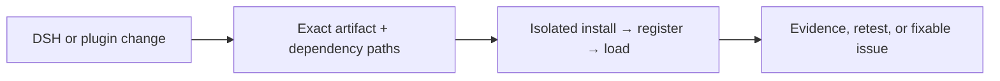

<h1 align="center">Upstream Radar</h1>

<p align="center"><strong>Find the DeepSeek Harness plugins that need attention when the ecosystem moves.</strong></p>

<p align="center">
  <a href="README-zh-CN.md">简体中文</a> ·
  <a href="https://github.com/MicroMilo/upstream-radar/actions/workflows/ci.yml"></a>
  <a href="https://www.npmjs.com/package/upstream-radar"></a>
  <a href="https://github.com/MicroMilo/upstream-radar/stargazers"></a>
  <a href="LICENSE"></a>
</p>

Upstream Radar continuously checks the relationship between an exact published
DSH plugin, its DSH host, and its dependency graph. When a DSH or plugin release
changes that relationship, Radar shows what changed, what was actually observed,
and what a maintainer can fix.

It is built for the [DeepSeek Harness (DSH)](https://github.com/deepseek-ai/deepseek-harness)
plugin ecosystem. A static review is evidence about a package; an isolated
runtime review is evidence about one exact `plugin × DSH × Node/profile` pair.
Neither is presented as a timeless compatibility badge or a security certificate.

## The problem

A source repository can be green while the package users install is not ready
for the current DSH host:

- the README advertises a version that was never published;
- a plugin imports a newer DSH package than its peer range allows;
- `package.json` and the lockfile describe different releases;
- an install-time build or dependency script needs tools the user does not have;
- a DSH host dependency is missing, so the dependency graph cannot be completed.

These are ecosystem relationship problems. They are easy to miss when the two
repositories are checked separately.

## What Radar does

1. **Pin the real inputs.** Read the exact npm artifact, DSH version, Node
   runtime, profile, lockfile, and dependency paths.
2. **Compare the relationship.** Detect upstream changes, package/release drift,
   incomplete graphs, and DSH contract mismatches.
3. **Observe when execution matters.** In a fresh, secret-free runner, install,
   register, and load the exact artifact; record the result and its boundary.
4. **Close the loop.** Produce bounded evidence, route meaningful changes to an
   optional DSH Agent, and update or close one maintainer-facing issue after a
   clean retest.



## Try a real check

No local DSH profile is needed for this first check. It reviews one exact
published artifact without executing plugin code:

```bash
npx --yes upstream-radar@0.43.4 inspect \
  @sanqi-normal/dsh-webui-market-plugin@0.5.4 \
  --deep --fail-on never
```

This historical DSH plugin release returns `review / incomplete` because its
published host dependency chain reaches an unavailable package. That is a
useful, reproducible release/host-contract report—not a claim of malicious
behavior. See the [full evidence report](examples/dsh/reports/sanqi-market-plugin-dependency-resolution.md).

To review your own public repository without installing it:

```bash
npx --yes upstream-radar@0.43.4 scan \
  https://github.com/owner/dsh-plugin \
  --fail-on never
```

The repository scan reads source manifests, DSH metadata, and lockfiles. It does
not install dependencies, run lifecycle scripts, load the plugin, start DSH, or
call an LLM.

## Run it on every change

Copy one of the maintained workflows into your repository:

- [Review one exact plugin across DSH versions](examples/github-actions/dsh-plugin-review-minimal.yml)
  — a manual check with artifact evidence and an isolated load matrix.
- [Observe one plugin repository every day](examples/github-actions/upstream-observer-minimal.yml)
  — compares commits, published versions, manifests, and dependency graphs, then
  wakes an Agent only when there is a meaningful change.
- [Run the dependency gate in CI](examples/github-actions/upstream-radar.yml)
  — checks the lockfile or reviewed Radar configuration before merge.

The [isolated observer workflow](.github/workflows/observe-dsh-plugin-install.yml)
uses a fresh GitHub-hosted runner for code-executing checks. The runner is not
your workstation and does not receive project secrets.

## Trust boundary

- Static collection never executes target-controlled code.
- Dynamic observation runs only in a disposable, bounded environment.
- The DSH Agent may choose a constrained follow-up or explain evidence; it cannot
  invent a dependency, turn missing evidence into a pass, or replace the runtime
  result.

## Evidence from the ecosystem

The repository keeps a [domain report index](docs/domain-reports.md) with public
issue links, validation level, impact, and the difference between a confirmed
runtime failure and a maintainer-confirmation request. The [compatibility feed](feeds/dsh-plugin-compatibility.md)
is machine-readable for plugin directories and other consumers.

If Upstream Radar helps you keep DSH plugins working as the ecosystem changes,
[please give the project a Star](https://github.com/MicroMilo/upstream-radar) ⭐
or open an issue with a plugin we should observe.
