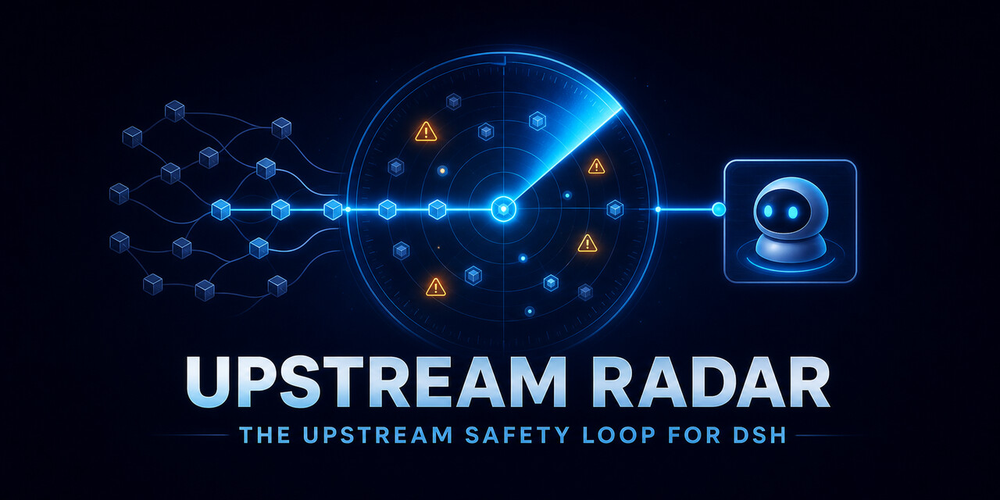

<h1 align="center">Upstream Radar</h1>

<p align="center"><strong>Always-on dependency radar for DeepSeek Harness plugins: exact paths, breaking-change signals, and project-aware Agent follow-up.</strong></p>

<p align="center">
  English · <a href="docs/README.zh-CN.md">简体中文</a>
</p>

<p align="center">
  <a href="https://www.npmjs.com/package/upstream-radar"></a>
  <a href="https://github.com/MicroMilo/upstream-radar/stargazers"></a>
  <a href="https://github.com/MicroMilo/upstream-radar/actions/workflows/ci.yml"></a>
  <a href="examples/dsh/README.md"></a>
  <a href="https://github.com/MicroMilo/upstream-radar/releases"></a>
  <a href="LICENSE"></a>
</p>

<p align="center">
  <a href="#try-it-in-60-seconds">Try it in 60 seconds</a> ·
  <a href="#see-one-incident">See one incident</a> ·
  <a href="#install-in-dsh">Install in DSH</a> ·
  <a href="#run-the-proof">Run the proof</a> ·
  <a href="#how-the-loop-works">How it works</a> ·
  <a href="ROADMAP.md">Roadmap</a>
</p>

## Try it in 60 seconds

Use a DSH profile that already contains at least one third-party bundle. Replace `web` with your profile name:

```bash
dsh plugin --profile web add upstream-radar@latest
pnpm dlx --package=upstream-radar@latest upstream-radar init \
  --profile web \
  --project-name "My DSH project" \
  --workspace "$PWD" \
  --output ./upstream-radar.config.json
export UPSTREAM_RADAR_CONFIG=$PWD/upstream-radar.config.json
dsh --profile web
```

The initializer writes a reviewable inventory; it does not start polling until `UPSTREAM_RADAR_CONFIG` is set. Read the [full DSH setup](#install-in-dsh) for state files, profile boundaries, and the real runtime proof.

If you want to try the monitoring loop without booting a DSH profile, run one cycle from a reviewed inventory:

```bash
pnpm dlx --package=upstream-radar@latest upstream-radar radar watch ./upstream-radar.config.json --once
```

Remove `--once` to keep a local monitor alive. This is a lightweight CLI surface for demos, CI, and diagnosis; the native DSH bundle remains the recommended always-on path because it can deliver the task to a live Agent.

<p align="center">
  <picture>
    <source media="(max-width: 600px)" srcset="docs/assets/upstream-radar-hero-mobile.jpg">
    
  </picture>
</p>

---

A vulnerability feed stops at “package X is affected.” Upstream Radar keeps going: it identifies the exact installed dependency path, maintains one durable incident, and wakes a [DeepSeek Harness](https://github.com/deepseek-ai/deepseek-harness) Agent with the project evidence needed for a useful investigation.

```text
OSV advisory or npm release
  -> exact installed plugin path
  -> new / updated / resolved incident
  -> project-specific DSH Agent analysis task
```

**No matching installed path means no Agent wake-up.** Version matching and compatibility facts are calculated by code; the model handles only repository-specific judgment.

## See one incident

If an advisory affects only one of two installed `parser` versions, Radar reports the path that actually matched:

```text
[HIGH][NEW] Dependency vulnerability
Project: Payments API (payments-api)
Plugin: plugin@1.0.0
Affected: parser@2.9.0
Advisory: GHSA-demo-2026-parser / CVE-2026-1234
Paths:
  plugin@1.0.0 -> logger@4.0.2 -> parser@2.9.0
Fixed versions: 3.0.0
Route: payments-platform via feishu:payments-security
```

That incident becomes a plugin-originated DSH notice. It is not copied into a generic chatbot prompt.

| Upstream signal | Radar proves deterministically | DSH Agent investigates |
| --- | --- | --- |
| Vulnerability or malicious package | affected `name@version`, every installed path, fixed versions, incident state | whether project code reaches it, attacker input can reach it, and the least disruptive fix |
| Candidate npm release | version boundary and Node.js, peer, export, entrypoint, bundle, and dependency changes | which APIs or Cordis configuration would break and what migration is appropriate |

## Install in DSH

Upstream Radar is an npm-published DSH bundle, so no install-time build permission is required:

```bash
dsh plugin --profile web add upstream-radar@latest
```

Generate the inventory from the DSH profile instead of writing the dependency graph by hand:

```bash
pnpm dlx --package=upstream-radar@latest upstream-radar init \
  --profile web \
  --project-name "My DSH project" \
  --workspace "$PWD" \
  --output ./upstream-radar.config.json
```

The initializer reads the profile's actual third-party bundles, resolves each exact npm artifact with lifecycle scripts disabled, and writes a reviewable config. It never starts DSH or enables polling by itself. Review the generated file, then point the bundle at it and choose a durable state file:

```bash
export UPSTREAM_RADAR_CONFIG=$PWD/upstream-radar.config.json
export UPSTREAM_RADAR_STATE=$PWD/upstream-radar.state.json
export UPSTREAM_RADAR_INTERVAL_SECONDS=1800

dsh --profile web --dump-config
dsh --profile web
```

The generated graph is the exact public npm artifact graph for the installed bundle versions. If your DSH profile applies package-manager overrides, patches, or unusual peer resolution, review those differences before enabling continuous monitoring.

For a hand-written or CI fixture, use [the example inventory](examples/radar/config.json). If `UPSTREAM_RADAR_CONFIG` is not set, the bundle stays dormant and performs no polling.

Once running, Radar polls OSV, npm, and public GitHub Releases, persists incident state before delivery, and submits only changed incidents to the first live root DSH Agent. If a source is temporarily unavailable, Radar keeps the last confirmed state instead of claiming that the project is clean, and continues delivering already queued tasks.

## Run the proof

Boot a real DSH `headless` profile with the packed Upstream Radar bundle installed:

```bash
git clone https://github.com/MicroMilo/upstream-radar.git
cd upstream-radar
corepack enable
pnpm install --frozen-lockfile
pnpm run try:dsh
```

No DeepSeek API key is required. The paid model endpoint is replaced by a deterministic local DeepSeek-compatible stub; the Cordis loader, DSH Agent, Session, persistence stack, bundle installation, and plugin delivery are real.

The command fails unless DSH proves all four facts:

```json
{
  "bundleInstalled": true,
  "radarTaskReachedModel": true,
  "pluginSourcePreserved": true,
  "pendingTasksAfterDelivery": 0
}
```

This proof runs in CI on Node.js 22. See the executable [showcase contract](examples/dsh/README.md) and its checked-in [result](examples/dsh/reports/headless-smoke.json). Run `pnpm run try:dsh:live` to include a current OSV and npm poll before the DSH handoff.

## How the loop works

1. Read the project inventory and exact installed npm graph.
2. Query OSV with every installed `name@version` pair.
3. Watch npm releases for the installed plugin and DSH/Cordis packages.
4. Create or update one durable incident with the exact dependency path.
5. Persist a constrained analysis task before delivery.
6. Send a plugin-originated follow-up to the first live root DSH Agent.
7. Keep the task on disk when no Agent is available; cancel it when the incident resolves.

For a local process or a scheduled runner, the same loop is available as:

```bash
pnpm dlx --package=upstream-radar@latest upstream-radar radar watch ./upstream-radar.config.json --interval 1800
```

Use `--once --json` for a machine-readable CI check. The command persists the same state file and emits only new, changed, or resolved incidents.

The handoff uses `ctx.agents.roots()[0].followup(...)` with:

```json
{
  "kind": "plugin",
  "plugin": "upstream-radar",
  "form": "notice"
}
```

It is a native DSH lifecycle integration—not a chat bridge or a remote-control bot.

## Why package-name alerts are not enough

Given this installed graph:

```text
plugin@1.0.0
├── framework@2.4.7
│   ├── parser@3.2.1
│   └── archive@1.8.0
└── logger@4.0.2
    └── parser@2.9.0
```

an advisory affecting `parser@2.9.0` matches only the `plugin -> logger -> parser` branch. The unaffected `parser@3.2.1` remains a distinct physical node instead of becoming a package-name false positive.

## Vulnerabilities are only half the upstream problem

Upstream Radar also watches candidate releases for compatibility boundaries that matter to DSH plugins:

- Node.js engine exclusions;
- incompatible `@deepseek-ai/dsh-*` or `@deepseek-ai/cordis` peer ranges;
- changed `main`, `exports`, or DSH bundle patch paths;
- removed dependencies;
- major and pre-1.0 breaking version boundaries;
- publisher-declared breaking changes in supplied release notes, including public GitHub Release notes attached to the candidate version when npm points to a GitHub repository.

These are signals for project analysis, not automatic claims that an upgrade is broken.

## The model gets judgment, not control of the facts

Upstream Radar determines facts that a model must not guess:

```text
parser@2.9.0 is reported as affected
plugin -> logger -> parser is the installed path
the project runs Node.js 22
the candidate requires Node.js >=24
the installed DSH peer is outside the candidate range
```

The DSH Agent answers the repository-specific questions:

```text
is the vulnerable feature reachable here?
can attacker-controlled input reach it?
which API or Cordis configuration would the upgrade disturb?
what is the least disruptive project-specific action?
```

Advisories, release notes, links, package names, and repository strings remain untrusted data. The generated task requires read-only analysis, project evidence, explicit uncertainty, and a fixed [result schema](schemas/analysis-result.schema.json).

## What works today

- npm lockfile graphs with duplicate versions and bounded dependency paths;
- exact-version OSV vulnerability and malicious-package matching;
- npm release monitoring for plugins and DSH/Cordis packages, with public GitHub Release notes attached when an exact candidate tag is available;
- durable incident state with current-task replacement and resolution;
- native DSH bundle installation, startup polling, `agent/created` retry, and plugin-source attribution;
- compatibility signals for Node.js, peers, exports, entrypoints, bundle paths, dependencies, and version boundaries;
- network-free Radar and real DSH runtime showcases.

The bounded pre-install scanner remains available as a supporting collector:

```bash
pnpm dlx --package=upstream-radar@latest upstream-radar scan /path/to/dsh-plugin
pnpm dlx --package=upstream-radar@latest upstream-radar inspect npm:dsh-cloudflare-browser-run@0.1.1 --deep
```

## Current boundaries

- `init --profile <name>` discovers a named DSH profile and generates a reviewable inventory; automatic active-profile selection and native pnpm override/peer resolution are not implemented yet.
- npm lock graphs are supported; pnpm and Yarn graph adapters are not implemented.
- OSV, npm `latest`, and public GitHub Release notes are live sources; changelog, comparison-diff, and migration-guide ingestion are deferred.
- A failed OSV check preserves confirmed matches and returns a visible source warning; durable source health history and health alerts are not implemented yet.
- `radar watch` is a CLI monitoring fallback; it does not deliver tasks into DSH by itself.
- Delivery currently targets the first live root Agent rather than a project-specific session.
- Agent conclusions stay in the DSH Session; Radar does not ingest them back into incident state yet.
- No Issue, branch, Pull Request, dependency override, or merge is created automatically.

Upstream Radar is alpha software built for the developer-preview DSH ecosystem. Event schemas and adapter boundaries can change.

## Project guide

- [Architecture](docs/architecture.md)
- [DSH headless showcase](examples/dsh/README.md)
- [Radar showcase walkthrough](docs/showcase.md)
- [Product vision（中文）](docs/vision.zh-CN.md)
- [Checks and evidence（中文）](docs/checks.zh-CN.md)
- [Threat model](docs/threat-model.md)
- [Roadmap](ROADMAP.md)
- [Changelog](CHANGELOG.md)
- [Release process](docs/releasing.md)
- [Contributing](CONTRIBUTING.md)
- [Security policy](SECURITY.md)

If DSH plugins are part of your stack, star the repository to follow the upstream safety loop as it grows. Start with the [reproducible DSH handoff showcase](https://github.com/MicroMilo/upstream-radar/discussions/11), then share questions and design feedback in [GitHub Discussions](https://github.com/MicroMilo/upstream-radar/discussions).

<sub>Community project for DeepSeek Harness. Not an official DeepSeek product. Apache-2.0 licensed.</sub>
