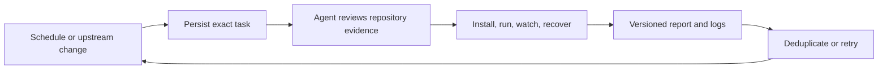

<h1 align="center">Upstream Radar</h1>

<p align="center"><strong>Know which DeepSeek Harness plugins still work—before users find out they do not.</strong></p>

<p align="center">
  <a href="README-zh-CN.md">简体中文</a> ·
  <a href="https://github.com/MicroMilo/upstream-radar/actions/workflows/ci.yml"></a>
  <a href="https://www.npmjs.com/package/upstream-radar"></a>
  <a href="https://github.com/MicroMilo/upstream-radar/stargazers"></a>
  <a href="LICENSE"></a>
</p>

Upstream Radar watches exact DSH and plugin releases, persists every affected
case, and wakes an Agent only when the input changes. The Agent reads the
repository, chooses evidence-backed Node.js and execution profiles, installs
and runs the exact artifacts in disposable CI, watches them while they run,
and publishes a reviewable compatibility report.

**No guessed matrix. No “install succeeded, therefore compatible.” No silent
unknowns.**

## What you get

- **Change-driven analysis** — a DSH release fans out to your plugin cohort; a
  plugin release analyzes only that plugin.
- **Agent-owned environment discovery** — README, manifests, lockfiles, CI, and
  startup scripts determine Node.js, package manager, and profile selection.
- **Active runtime supervision** — the Agent reads incremental logs, inspects
  running processes, handles recoverable build gates, adjusts, and retries.
- **Exact, durable evidence** — every report is bound to plugin bytes, source
  commit, DSH version, Node.js version, profile, commands, and logs.
- **Safe retries and deduplication** — interrupted executor work stays pending;
  an unchanged completed input does not run twice.

## The loop


```mermaid
flowchart LR
  Change["Schedule or upstream change"] --> Task["Persist exact task"]
  Task --> Agent["Agent reviews repository evidence"]
  Agent --> Run["Install, run, watch, recover"]
  Run --> Report["Versioned report and logs"]
  Report --> State["Deduplicate or retry"]
  State --> Change
```

The model recommends and operates within a bounded tool contract. Deterministic
code selects exact versions, verifies artifacts, isolates execution, and decides
whether evidence is complete. Plugin code never receives model credentials or
repository write tokens.

## See it working

- [Live compatibility report index](examples/dsh/active-agent/reports/README.md)
  — completed means the analysis closed, **not** that the plugin passed.
- [A real `context` Agent run](https://github.com/MicroMilo/upstream-radar/actions/runs/36435594284/job/108979891718)
  — repository review, Node/profile reasoning, isolated execution, and active
  watches in one case.
- [A green durable retry cycle](https://github.com/MicroMilo/upstream-radar/actions/runs/36439763569)
  — the same persisted inputs produced an empty matrix instead of duplicate work.

Reports preserve `compatible`, `incompatible`, `unknown`, and externally blocked
outcomes separately. Missing credentials, missing coverage, and executor faults
cannot become a pass.

## Try it in 30 seconds

Inspect one exact published artifact without executing plugin code:

```bash
npx --yes upstream-radar@0.45.0 inspect \
  @sanqi-normal/dsh-webui-market-plugin@0.5.4 \
  --deep --fail-on never
```

Or review a public plugin repository without installing it:

```bash
npx --yes upstream-radar@0.45.0 scan \
  https://github.com/owner/dsh-plugin \
  --fail-on never
```

The static commands read bounded package and repository evidence. They do not
install dependencies, execute lifecycle scripts, start DSH, or call an LLM.

## Automate the compatibility loop

Start from one maintained workflow:

- [Watch a plugin repository every day](examples/github-actions/upstream-observer-minimal.yml)
- [Review an exact plugin across DSH versions](examples/github-actions/dsh-plugin-review-minimal.yml)
- [Gate dependency changes in CI](examples/github-actions/upstream-radar.yml)

This repository's deployed loop runs from
[`upstream-observer.yml`](.github/workflows/upstream-observer.yml). Its single
operator entry point is
[`examples/dsh/active-agent/policy.json`](examples/dsh/active-agent/policy.json):

```json
{
  "schema": "upstream-radar.dsh-active-agent-policy/v1alpha1",
  "dsh": { "channel": "next" },
  "defaults": {},
  "plugins": [
    { "targetId": "context" },
    { "targetId": "dsh-tui" }
  ]
}
```

Leave Node.js and profiles unset to let the Agent infer them. Override them
globally or per plugin when you need a fixed experiment. Exact DSH or plugin
versions require a matching `sourceRef`, so repository evidence cannot drift
from installed bytes. See the [policy reference](examples/dsh/active-agent/POLICY.md).

## What a result means

| Result | Meaning |
| --- | --- |
| `compatible` | The exact tested cell completed its required install and runtime checks. |
| `incompatible` | Reproducible evidence failed a required compatibility boundary. |
| `unknown` | Execution happened, but coverage or attribution was insufficient. |
| `blocked` | An external account, credential, source, or executor prevented completion. |

Results are scoped observations, not permanent compatibility badges or security
certificates. A new artifact, source commit, DSH release, runtime policy, or
expired evidence creates a new input.

## Built for

- **Plugin authors** who want release failures caught before users report them.
- **DSH ecosystem maintainers** who need one comparable, auditable evidence feed.
- **Platform teams** that need repeatable upgrade decisions instead of a manual
  README-and-log investigation.

Upstream Radar is listed by
[awesome-dsh-plugin](https://github.com/awesome-dsh-plugin/awesome-dsh-plugin/blob/main/data/plugins/MicroMilo__upstream-radar.yml),
[awesome-deepseek-harness](https://github.com/0xsline/awesome-deepseek-harness), and
[awesome-deepseek-harness-plugins](https://github.com/imsai-sh/awesome-deepseek-harness-plugins/blob/main/catalog/plugins/micromilo--upstream-radar.json).

<p align="center">
  <strong>If this is the compatibility loop your plugin ecosystem needs, <a href="https://github.com/MicroMilo/upstream-radar">give Upstream Radar a Star</a> ⭐</strong>
</p>
