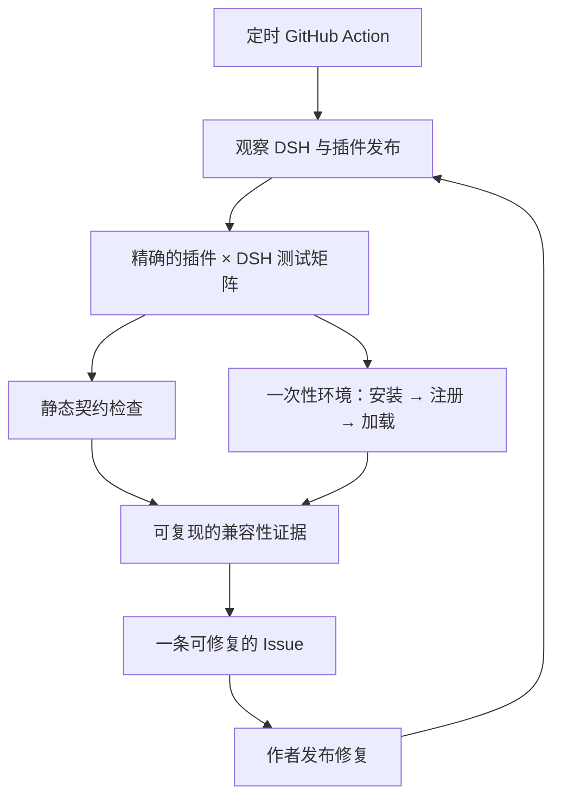

<h1 align="center">Upstream Radar</h1>

<p align="center"><strong>每次 DeepSeek Harness 发布后，在用户踩坑前找出哪些插件坏了。</strong></p>

<p align="center">
  <a href="README.md">English</a> · 简体中文
</p>

<p align="center">
  <a href="https://github.com/MicroMilo/upstream-radar/actions/workflows/ci.yml"></a>
  <a href="https://www.npmjs.com/package/upstream-radar"></a>
  <a href="https://github.com/MicroMilo/upstream-radar/stargazers"></a>
  <a href="LICENSE"></a>
</p>

Upstream Radar 持续把一批真实插件发布物放到一次性隔离环境中，与不断变化的
[DeepSeek Harness（DSH）](https://github.com/deepseek-ai/deepseek-harness)
版本重新配对测试。某个组合坏了，就生成一条可复现的 Issue；作者发布修复后，
Radar 会再次检查并关闭闭环。

**维护 10 个真实插件发布物 · 37 张真实依赖图 · 1,025 个依赖坐标 · 4 条上游报告已关闭**

## 为什么需要它

仓库看起来正常，不代表用户实际安装的插件仍然可用。真实发布物必须同时适配某个
DSH 版本、Node 运行时、profile 和依赖组合；其中任何一项更新，都可能让插件一夜
之间失效。

Upstream Radar 检查的是这层真实关系，而不只是分别看两个仓库。本地发布前检查
回答“这个插件今天能不能过”；Radar 回答“生态变化后，维护中的哪些插件不再能过”。

## 完整闭环



Radar 用确定性证据得出结果。DSH Agent 可以补充影响解释和下一步建议，但模型不能
把缺失的证据说成通过。

## 你会得到什么

- `插件版本 × DSH 版本 × Node/profile` 的精确结果，而不是永不过期的“兼容”标签。
- 把静态依赖和 peer 契约，与真实发布物的安装、注册、加载结果放在一起判断。
- DSH 或插件变化后自动重新检查，而不是只生成一次报告。
- 同一问题持续更新；回归时重新打开；干净复测通过后自动关闭。

## 已关闭的上游报告

以下报告由我们提出，目前均已被对应上游维护者关闭：

- [Sanqi-normal/dsh-webui-market-plugin#5](https://github.com/Sanqi-normal/dsh-webui-market-plugin/issues/5)
- [1na-ko/dsh-hdc-bridge#3](https://github.com/1na-ko/dsh-hdc-bridge/issues/3)
- [6Mikao9/dsh-wsl-workspace#6](https://github.com/6Mikao9/dsh-wsl-workspace/issues/6)
- [3274375092/dsh-voice#2](https://github.com/3274375092/dsh-voice/issues/2)

## 检查一个插件

```bash
npx --yes upstream-radar@0.41.0 review dsh-plugin \
  <包名>@<版本> \
  --dsh-version <DSH版本>
```

需要执行插件代码时，请使用仓库维护的
[隔离观察工作流](.github/workflows/observe-dsh-plugin-install.yml)：每个组合都会获得
一台全新的、无密钥的 GitHub 托管虚拟机和受限容器。

你还可以查看[实时兼容性矩阵](examples/dsh/install-observer/README.md)、
[第一批 50 个插件](examples/dsh/first-batch/README.md)和
[架构说明](docs/architecture.md)。

<p align="center">
  <strong>如果 Upstream Radar 对 DSH 生态有帮助，欢迎<a href="https://github.com/MicroMilo/upstream-radar">点一个 Star</a> ⭐</strong>
</p>
